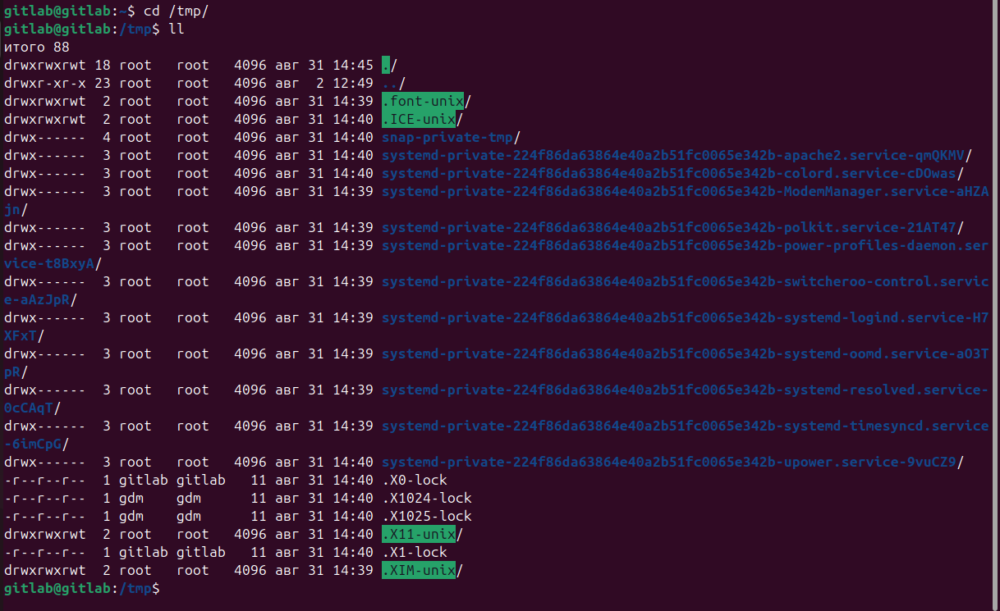
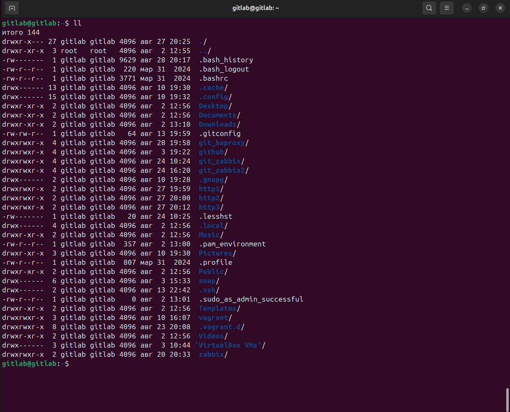
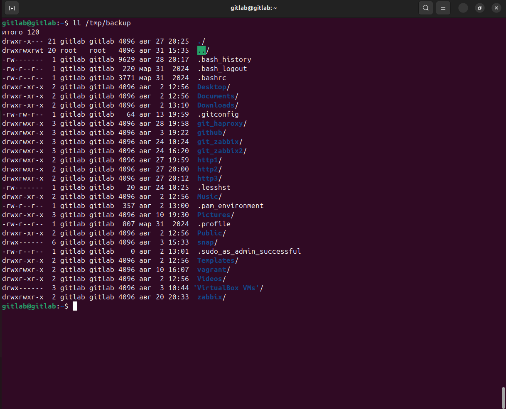
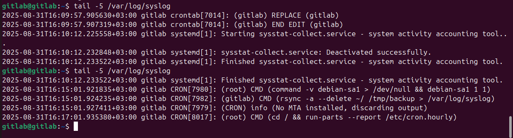

# Домашнее задание к занятию «Резервное копирование» - 'Пшённов Николай'

## Задание 1
`Составьте команду rsync, которая позволяет создавать зеркальную копию домашней директории пользователя в директорию /tmp/backup`
`Необходимо исключить из синхронизации все директории, начинающиеся с точки (скрытые)`
`Необходимо сделать так, чтобы rsync подсчитывал хэш-суммы для всех файлов, даже если их время модификации и размер идентичны в источнике и приемнике.`
`На проверку направить скриншот с командой и результатом ее выполнения`

### Решение
* `Проверяю содержимое директории /tmp на отсутствие директории /backup`


* `Команда rsync`
```
rsync -ac --progress --delete --exclude '.*/' ~/ /tmp/backup
```


* `Сравниваю содержимое домашней директории и директории /tmp/backup`



## Задание 2
`Написать скрипт и настроить задачу на регулярное резервное копирование домашней директории пользователя с помощью rsync и cron.`
`Резервная копия должна быть полностью зеркальной`
`Резервная копия должна создаваться раз в день, в системном логе должна появляться запись об успешном или неуспешном выполнении операции`
`Резервная копия размещается локально, в директории /tmp/backup`
`На проверку направить файл crontab и скриншот с результатом работы утилиты.`

### Решение
* `Создаю задачу на регулярное (ежедневное) резервное копирование домашней директории пользователя в директорию /tmp/backup`
```
crontab -e
```
`вношу строчку`
```
15    16    *    *    *    rsync -a --delete ~/ /tmp/backup > /var/log/syslog
```
[Файл](file/crontab)

* `Проверяю логи до и после установленного времени`


* `Проверяю содержимое директории /tmp/backup`


---
